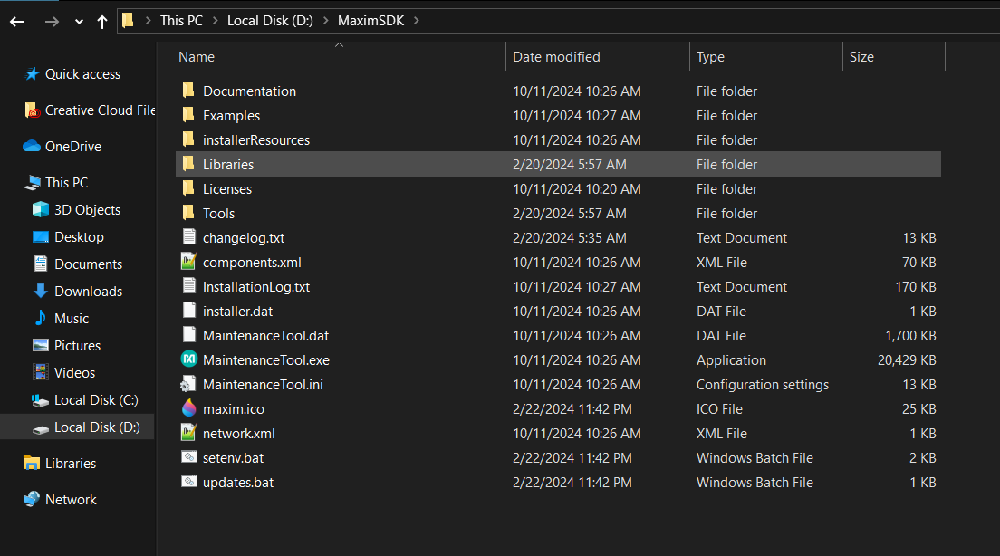

# MaximSDK Installation and Activities

The first activity is about using LEDs in Maxim780000. Below is a screenshot of the MaximSDK installation.

## Activities

- Click here for Task 1: [Blinking LED](LED/main.c)
- Click here for Task 2: [LED Flow](LED%20Flow/main.c)

---
